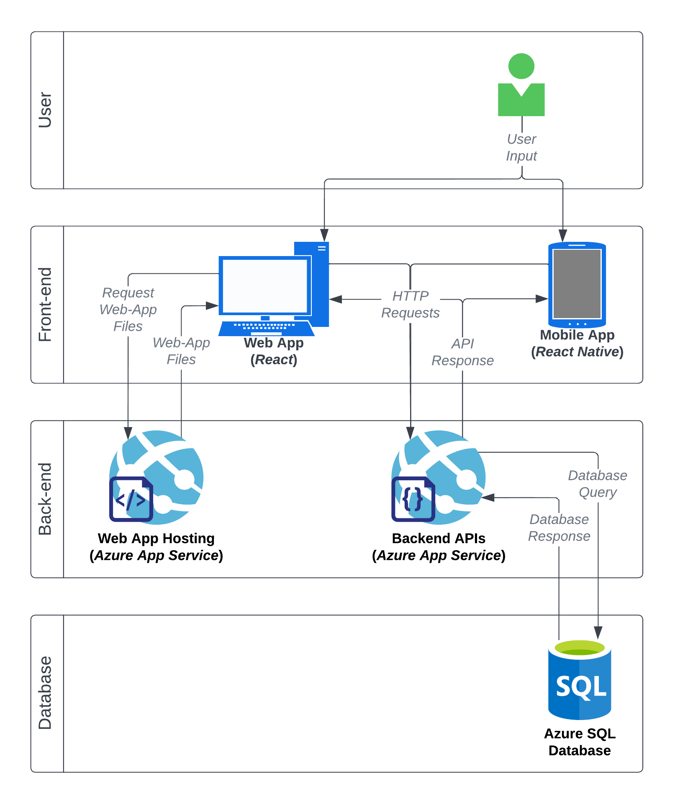

# 
Full Stack Todo App - Implementation Plan

## Technologies to Use

### Programming Languages

#### _SQL_

I have minimal experience working with SQL databases.
Most of my prior experience has been with Google Firebase's Firestore, which is a NoSQL database.
Many software jobs ask for SQL experience, so I have chosen to use this technology exclusively to gain more experience.

#### _C#_

To build the backend APIs, I will use Microsoft's ASP.NET Core framework.
Again, I have noticed that many jobs ask for experience in .NET, and I have none. This choice is purely to give me more experience.

#### _Typescript_

I plan on using React and React Native for the web and mobile apps. To build these front end, I will use TypeScript, due to the improved type-safety and idiotproof-ness it offers over JavaScript.

#### _Bash_

I will use bash commands in Taskfiles to make development, test, and build processes easier.

### Frameworks/Platforms

I have no experience with .NET or Azure servies, but I know these tools are often used in industry. I am choosing to use Azure's selection of cloud tools purely to gain more experience in them.

#### _Azure SQL Database (DB PaaS)_

Azure SQL Database will allow me to deploy, scale, and manage a SQL database with minimal effort. The service also provides APIs for various languages, including Python, PHP, C# (.NET Core), Java, and JavaScript/TypeScript (Node.js) to interact with the deployed database.

#### _Azure App Service (PaaS)_

I will use Azure App Service to host my backend APIs. The backend APIs will provide HTTP endpoints for the frontend, and will query the SQL database. Azure App Service will also host the static web-app files. Azure App Service will make deployment, management, and scaling the APIs and web-app files easy.

#### _ASP.NET Core_

I will build the backend APIs using the ASP.NET Core framework. Documentation is good, and it is a tool often used in industry, which is beneficial to gain experience in.

### Other Tools

#### _Taskfiles_

Taskfiles is an easy, functional, cross-platform task runner which can run commands in the terminal. This will make development, test, and build processes easy and consistent.

## Architecture Overview

